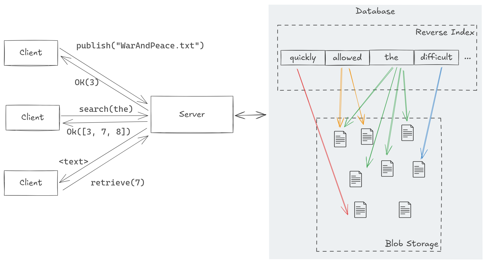

# ngram

> _The [Google Ngram Viewer](https://books.google.com/ngrams/) is a powerful
> online tool that lets you search for the occurrence of words across 5 million
> books published over last few centuries._

In this assignment, you'll implement a simple version of the Google Ngram
Viewer. It will have a server that accepts requests over the network and a
client that sends them. It will support the operations of

1. "Publishing" a book to the database
2. Searching for books that contain a certain word
3. Retrieving the full text of a book

Crucially, since the server aims to support many clients at once, it will be
multi-threaded, meaning the core data structures that allow adding and querying
books must use proper synchronization, like mutexes.

An overview of the system is shown below:



In this assignment, you'll gain experience with

- building concurrency-safe data structures
- using a thread pool to manage concurrent tasks
- serializing and deserializing data to be sent over the network
- opening and managing TCP network connections

**Notes:**

1. Submissions should not have compilation warnings or errors.

2. Code you submit should be formatted with `rustfmt`, the standard Rust
   formatter. VSCode's built-in formatting should take care of this.

3. Pay close attention to the type signatures for the stencil functions that
   you must implement. Trait bounds and return types can give you hints about
   what the function should do if the handout does not make it clear. If you
   don't know how to use a type, try searching for it in the Rust [standard
   library documentation](https://doc.rust-lang.org/std/index.html)

4. Do not change any type signatures of existing functions or member types of
   existing structs.

## Part 1

In the first part of this assignment, you'll implement the building blocks that
you will use to construct the client and server binary in part 2.

As always, stencil code has been provided with method signatures. Do not change
these signatures, as it may cause the autograder to fail.

## Part 1.1: Concurrent Multimap

In order to efficiently find the set of books that contain a word, we'll use a
[Reverse Index](https://en.wikipedia.org/wiki/Reverse_index). Simply put, this
is a mapping from each word to the set of documents that contain that word.
Since we want many threads to be able to read and write to the reverse index at
once, we'll need to make it thread-safe. To do this, you'll implement a
_concurrent multimap_: a data structure that maps keys to sets of values, where
read and write operations use internal synchronization to provide
thread-safety.

All the code for this part will be written in the `multimap.rs` file. You are
in charge of implementing the following functions.

```rust
impl<K: Hash + Eq, V: Clone + Eq> ConcurrentMultiMap<K, V> {
    pub fn new(bucket_count: usize) -> Self;
    pub fn get<Q>(&self, key: &Q) -> Vec<V>;
    pub fn set(&self, key: K, value: V);
}
```

A simple may to implement the concurrent multimap is to use a `HashMap` wrapped
in a single mutex. This would be correct, but would provide poor performance
since only one task can read or write to the map at once. Instead, the map will
consist of a series of "buckets", where each bucket is a linked list of
the items it contains. When adding or retrieving a key, we can find the bucket
it belongs in by hashing the key and modulo-ing by the number of buckets.

To make the map thread-safe, each bucket is protected by a "Readers-writers
lock" (`RwLock` in Rust), which allows multiple readers to access the bucket at
once, but only one writer. Using a `RwLock` is ideal for our applications, as
the server is expecting a read-heavy workload, with more readers than writers.
If only readers are present, the threads will never have to wait when taking
the lock, resulting in good performance. Even in the presence of many writers,
the bucketed approach is superior to the single mutex approach, as many tasks
can write to the map as long as they are writing to different buckets.
Therefore, ensuring good performance for our application requires that we
pre-allocate enough buckets.

Now, implement the functions with `TODO` comments in the `multimap.rs` file. When you're
finished, you can test your implementation by running the following command:

```sh
cargo test multimap
```

**Notes:**

To hash a value `x`, you can use the following code:

```rust
let mut hasher = DefaultHasher::new();
x.hash(&mut hasher);
let hash = hasher.finish();
```

Locking a `RwLock` for reading could look like the following. If a writer is
present, this could will block until the writer releases the lock.

```rust
let guard = rwlock.read().unwrap();
println!("The value is: {}", *guard);
```

Locking a `RwLock` for writing could look like the following. If readers or a
writer are present, this call will block until they all relinquish their locks.

```rust
let mut guard = rwlock.write().unwrap();
*guard = 42;
```

For more help completing this section, see the documentation for

- [RwLock](https://doc.rust-lang.org/std/sync/struct.RwLock.html)
- [LinkedList](https://doc.rust-lang.org/std/collections/struct.LinkedList.html)

### Limitations

Note some simplifications we've made to make this assignment more manageable:

- The map has a fixed number of buckets. In real applications, you might want
  to resize the map when it gets too full.
- The map does not support removing keys or values.
- The map requires the value type `V` to be `clone`able. This is so that we can
  return a copy of the value when `get` is called. A better interface would
  return a reference to the value inside the map, but this would require
  more complex lock management. Do you see why?

If you use this project as a base for your final project, you might want to
consider how to remove these limitations.

## Part 1.2: Thread Pool

In order to manage the many connections that the server will receive, we'll use
a _thread pool_. A thread pool is a set of threads that collectively execute
jobs from a shared pool of work. Thread pools are a good way to use parallelism
to handle thousands of tasks without actually spawning thousands of threads,
which may have a high overhead.

Our `ThreadPool` struct in `pool.rs` provides only two functions

```rust
    pub fn new(size: usize) -> ThreadPool;
    pub fn execute<F>(&self, f: F)
```

The `new` function creates a new thread pool with a fixed number of threads,
and the `execute` function takes a closure and adds it to the queue of work to
be completed by the thread pool.

Internally, our thread pool will use a channel to send closures to the worker
threads for completion. The worker threads will loop, receiving closures from
the channel and executing them. When the thread pool is dropped, the worker
threads will exit.

Now implement the functions with `TODO` comments in the `pool.rs` file. When you're
done you can test your implementation by running the following command:

```sh
cargo test pool
```

Note that some test may fail by not terminating if you have a deadlock. This
will cause the test to hang indefinitely. To debug this, you can run the tests
individually.

## Part 1.3: Serialization

In order for the client and the server to communicate over the network, they
must agree on a standard set of messages they can send. For our application,
the messages a client can send are

`Publish`: A message that contains the text of a document to be published

`Search`: A message that contains a word to search for in the documents.

`Retrieve`: A message that contains the id of a document to retrieve.

The messages the server can respond with are

`PublishResponse`: A message that contains the id of the document that was published.

`SearchResponse`: A message that contains a list of document ids that contain the word.

`RetrieveResponse`: A message that contains the text of the document.

`Failure`: A message that indicates that the server was unable to process the request.

To send these messages over the network, we'll serialize them into a list of
bytes. While there are crates that can do this automatically, we will do it
manually to give you a better understanding of how serialization works.

Now, implement the following functions in the `message.rs` file.

```rust

impl Request {
    pub fn to_bytes(&self) -> Vec<u8>;
    pub fn from_bytes<R: std::io::Read>(mut reader: R) -> Option<Self>;
}
impl Response {
    pub fn to_bytes(&self) -> Vec<u8>;
    pub fn from_bytes<R: std::io::Read>(mut reader: R) -> Option<Self>;
}
```

When you're finished, you can test your implementation by running the following command:

```sh
cargo test serialize
```

It's up to you how you turn the messages into bytes, so all these tests check
is that converting a message to bytes and back to a message results in the same
message.

### Notes:

**Reading:**

To be generic over types that can be "read" from (including files, network
connections, strings, etc.), the `from_bytes` functions take any type that
implements `std::io::Read`. To read bytes from a reader, you can allocate a
fixed-size buffer and call `read` on the reader.

```rust
let mut buffer = [0; 8];
reader.read_exact(&mut buffer).unwrap();
```

This interface for reading that Rust provides does not have the buffer overflow
problems you may have seen in C, since the variable `buffer` has it's size
encoded in its type, so `read_exact` knows exactly how many bytes to read.

**Converting to/from bytes:**

It is up to you how you convert the messages to bytes; however, one reasonable
approach for each type of data is as follows:

For numbers, they can be converted to bytes using the `to_be_bytes` method, and
converted from bytes using the `from_be_bytes` method. The `be` stands for "big
endian", the most common way to represent numbers in network protocols.

```rust
// To bytes
let bytes = vec![];
let n = 42;
bytes.extend(number.to_be_bytes().iter());

// from bytes
let bytes = [0; 8];
reader.read_exact(&mut bytes).unwrap();
let n = usize::from_be_bytes(bytes);
```

For strings, they can be converted to bytes by first writing the length of the
string, and then writing the bytes of the string itself. This way, when reading
the string back, you know how many bytes to read. The bytes of a string can be
accessed with the `.as_bytes()` method.

Finally, you will need some way to know which of the three request/response
types you are deserializing.

## Part 2

Now that you have implemented the building blocks, you can use them to implement
the client and server.

## Part 2.1: Argument Parsing

In this part, you'll implement the command line interface for the client and
server.

### Using `clap`

To give you experience using Rust crates, you'll parse user arguments using the
[clap](https://docs.rs/clap/latest/clap/) crate. Clap uses macros and types to
automatically generate a command line interface for your program based on a
struct of your arguments. For example, take the following struct and usage.

```rust
use clap::Parser;
#[derive(Parser, Debug)]
#[command(version, about, long_about = None)]
struct Args {
    /// Name of the person to greet
    #[arg(short, long)]
    name: String,

    /// Number of times to greet
    #[arg(short, long, default_value_t = 1)]
    count: u8,
}
```

```rust
fn main() {
    let args = Args::parse();

    for _ in 0..args.count {
        println!("Hello {}!", args.name);
    }
}
```

Calling `Args::parse()` in your code automatically generates a command line
interface like the following.

```sh
$ cargo run -- --help
A simple to use, efficient, and full-featured Command Line Argument Parser

Usage: demo[EXE] [OPTIONS] --name <NAME>

Options:
  -n, --name <NAME>    Name of the person to greet
  -c, --count <COUNT>  Number of times to greet [default: 1]
  -h, --help           Print help
  -V, --version        Print version

$ cargo run -- --name Me
Hello Me!
```

Note how the command line flags and short names have been automatically
generated from the names of the members of the struct and their documentation
comments. `help` and `version` flags are also automatically generated.

### Your Task

Using Clap, implement the `main()` function in `main.rs` to support the
following command line interface.

```sh
$ cargo run -- client <server address> <server port> publish <path to document>
$ cargo run -- client <server address> <server port> search <word>
$ cargo run -- client <server address> <server port> retrieve <document id>
```

```sh
$ cargo run -- server <listen port>
```

This section will be tested manually, so your implementation does not need to
exactly conform to this interface. However, it must support the same
functionality. Therefore,

- You must support starting in client mode and sending a publish request, with the path to the document to publish passes as a command line argument.
- You must support starting in client mode and sending a search request, with the word to search for passed as a command line argument.
- You must support starting in client mode and sending a retrieve request, with the document id to retrieve passed as a command line argument.
- For each client request, you must support connecting to an arbitrary address/port
- You must support starting in server mode and listening on an arbitrary port.

You can test your implementation by running your application from the command
line. Recall that you can pass arguments to your application by running `cargo
run -- <args>`. You can find some test documents in the `data` directory.

Since we haven't implemented the client and server functionality yet, you can
either use the `unimplemented!()` macro (an alias for `panic!()`) after parsing
arguments, or call the (unimplemented) functions that you find in the stencil
for `client.rs` and `server.rs`.

To help get started, you can look at the [clap
documentation](https://docs.rs/clap/latest/clap/) or clap tutorials on the
internet. You may find `subcommands`, as detailed in [this brief
tutorial](https://docs.rs/clap/latest/clap/_derive/_tutorial/chapter_0/index.html),
helpful.

## Part 2.2: The Client

Now that the command line interface is implemented, you can implement the
client functionality. The client interface is relatively simple. A client
struct can be constructed with a server address, and then supports three
operations, `publish_from_path`, `search`, and `retrieve`.

Each of these functions should...

1. construct the request
2. serialize the request into bytes
3. open a TCP connection to the Server
4. send the bytes over the Connection
5. read the response from the Connection
6. deserialize the response into a response
7. Return the response

Now, implement the following functions in `client.rs`.

```rust
impl Client {
    pub fn new(address: String) -> Self;
    pub fn publish_from_path(&self, path: &str) -> Option<Response>;
    pub fn search(&self, word: &str) -> Option<Response>;
    pub fn retrieve(&self, id: usize) -> Option<Response>;
}
```

You've already implemented the serialization and deserialization functions, so
each of these functions should be relatively simple.

If you didn't do so in the previous section, add calls to these functions in
`main.rs` so that you can create a new client struct and send a request to the
server based on the command line arguments provided.

There are no tests for this section, as the client relies on having a running
server to function. After you complete the next section, you will be able to
test the client and server together.

## Part 2.3: The Server

Finally, we can implement the server. The server is a bit more complex than the
client, as it must manage multiple connections with shared access to the
database. To do this, you'll use the thread pool you developed previously.

The server process will consist of two threads plus the thread pool:
1. A main thread that spawn the others and then waits until the server is stopped with the `stop()` method.
2. A listener thread that listens for incoming connections and adds them to the thread pool task queue.
3. A thread pool that processes the incoming connections.

These threads are spawned in `listen`. The full set of functions you'll implement is

```rust
// in `server.rs`
fn process_message(state: Arc<ServerState>, request: Request, mut stream: TcpStream);

impl Server {
    pub fn new() -> Self;
    fn listen(&self, port: u16);
    pub fn run(&self, port: u16);
}
```

To implement the ngram functionality, the server stores a `Database` struct
that contains the reverse index and the blob store. The `Database` struct has
the following functions

```rust
// in `database.rs`
impl Database {
    pub fn new() -> Self {
    pub fn publish(&self, doc: String) -> usize;
    pub fn search(&self, word: &str) -> Vec<usize>;
    pub fn retrieve(&self, index: usize) -> Option<String>;
}
```

These functions have straightforward implementations based on using the
functionality of the ConcurrentMultiMap.

Now, implement all functions in the `server.rs` and `database.rs` files. When you're
done, you can test your implementation by running the following command:

```sh
cargo test integration
```

If you didn't do so in the previous section, add calls to these functions in
`main.rs` so that you can run the client and server from the command line. For
example, in one terminal run 

```sh
cargo run -- server 8080
```
And in another server you should be able to have the following interaction
```sh
$ cargo run -- client "127.0.0.1" 8080 publish "data/austen-emma.txt"
PublishResponse(0)
$ cargo run -- client "127.0.0.1" 8080 search "the"
SearchResponse([0])
$ cargo run -- client "127.0.0.1" 8080 retrieve 0
RetrieveResponse("Emma Woodhouse, handsome, clever, and rich, with a comfortable home...")
```

## Finishing Up

When you're finished, you can test your implementation by running all the tests
with `cargo test` or by using the command line interface. To see the effects of
multi-threading, try running the test `test_server_stress_test_10` with varying
values for the `WORKERS` parameter in `server.rs` and noticing how the
performance changes. You can also uncomment the `println` calls in this test to
see a timing comparison of fetching many documents with parallelism and without
parallelism. Note that test output is only printed if the test fails, so you'll
need to add a call to `panic!()` at the end of the test to see these timing
details printed.


```rust
cargo test test_server_stress_test_10 
```

When you are ready, submit to Gradescope and make sure the autograder run
successfully. Congratulations!
